# Лабораторная работа. Основы работы в среде разработки игр и интерактивных приложений. Основы работы c Unity.
Отчет по лабораторной работе #1 выполнил(а):
- Строшков Артем Валерьевич
- РИ-300004

Отметка о выполнении заданий (заполняется студентом):

| Задание | Выполнение | Баллы |
| ------ | ------ | ------ |
| Задание 1 | * |  |
| Задание 2 | * |  |
| Задание 3 | * |  |

знак "*" - задание выполнено; знак "#" - задание не выполнено;

Работу проверили:
- к.т.н., доцент Денисов Д.В.
- к.э.н., доцент Панов М.А.
- ст. преп., Фадеев В.О.

Структура отчета

- Данные о работе: название работы, фио, группа, выполненные задания.
- Цель работы.
- Задание 1.
- Код реализации выполнения задания. Визуализация результатов выполнения (если применимо).
- Задание 2.
- Код реализации выполнения задания. Визуализация результатов выполнения (если применимо).
- Задание 3.
- Код реализации выполнения задания. Визуализация результатов выполнения (если применимо).
- Выводы.
- ✨Magic ✨

## Цель работы
Ознакомиться с основными функциями Unity и взаимодействием с объектами внутри редактора.

## Задание 1
### В разделе «ход работы» пошагово выполнить каждый пункт с описанием и примерами реализации задач по теме видео самостоятельной работы.

#### Ход работы (задание 1).
1) Создать новый проект из шаблона 3D – Core;
2) Проверить, что настроена интеграция редактора Unity и Visual Studio Code
(пункты 8-10 введения);
3) Создать объект Plane;
4) Создать объект Cube;
5) Создать объект Sphere;
6) Установить компонент Sphere Collider для объекта Sphere;
7) Настроить Sphere Collider в роли триггера;
8) Объект куб перекрасить в красный цвет;
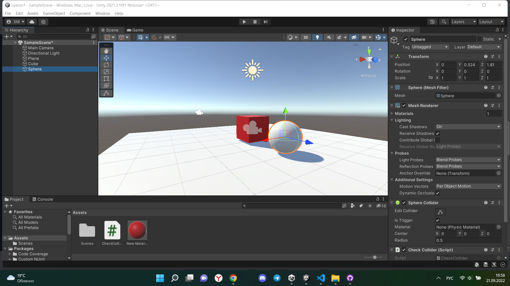

9) Добавить кубу симуляцию физики, при это куб не должен проваливаться
под Plane;
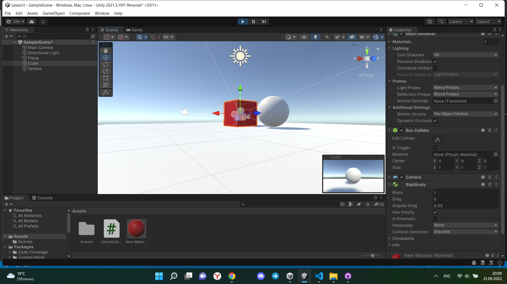

10) Написать скрипт, который будет выводить в консоль сообщение о том,
что объект Sphere столкнулся с объектом Cube;
11) При столкновении Cube должен менять свой цвет на зелёный, а при
завершении столкновения обратно на красный.
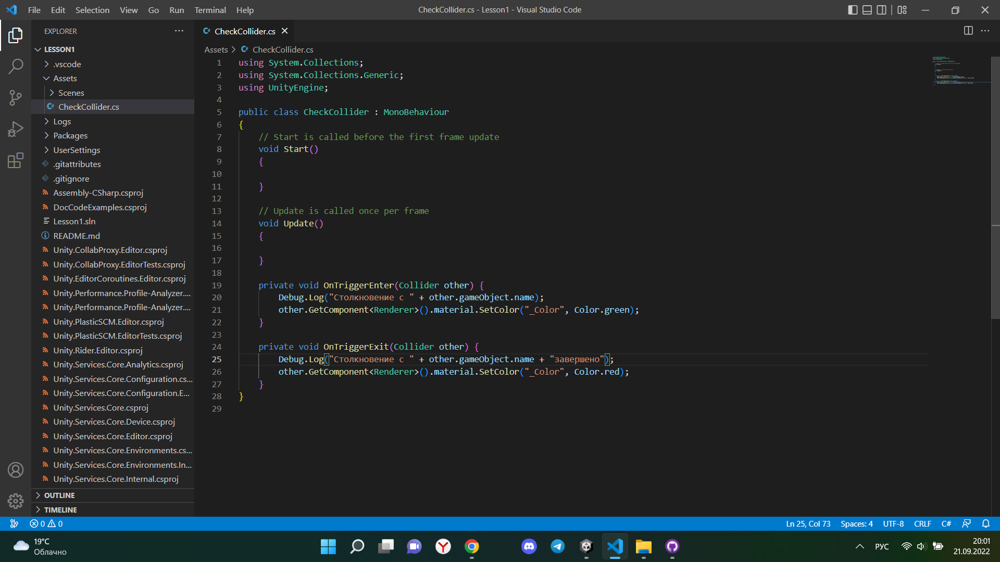
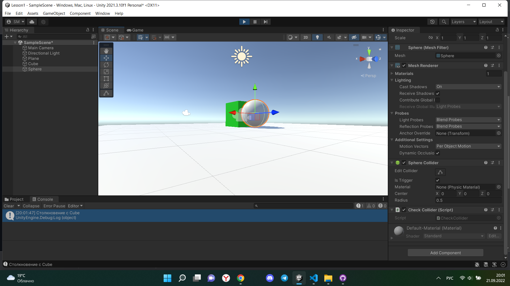
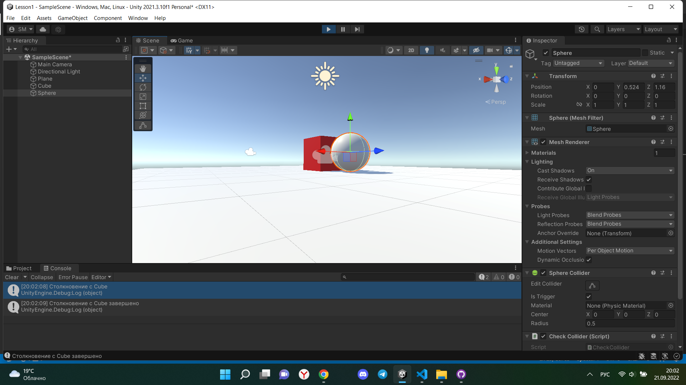

Код
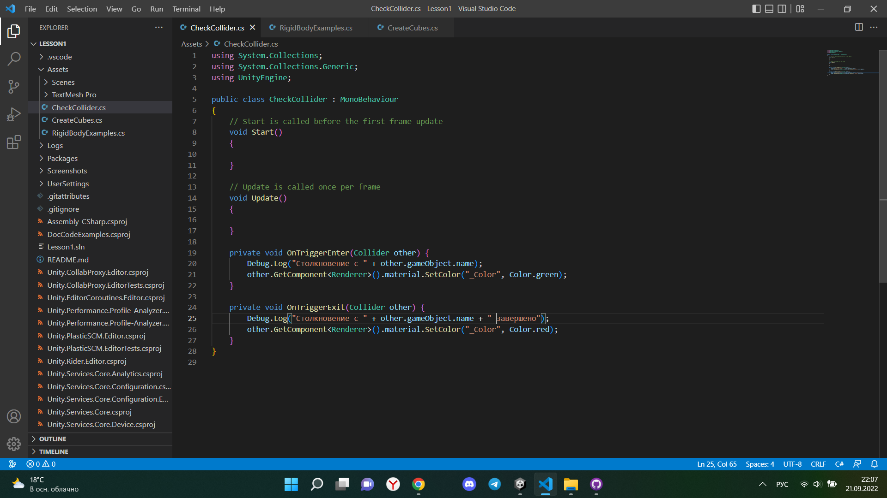

## Задание 2
### Продемонстрируйте на сцене в Unity следующее:
#### - Что произойдёт с координатами объекта, если он перестанет быть дочерним?
#### - Создайте три различных примера работы компонента RigidBody

#### Ход работы (задание 2).
1)Объект является дочерним

2)Объект не является дочерним
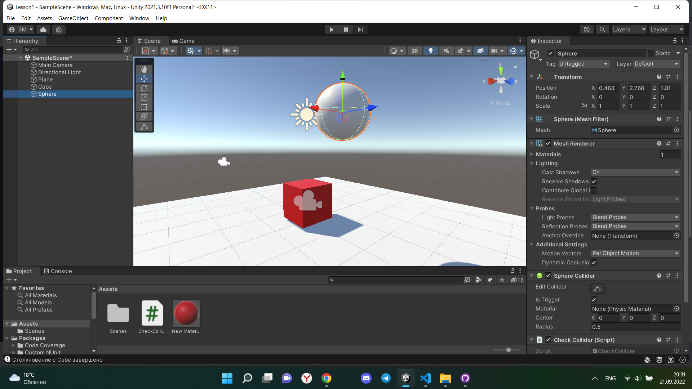

Координаты дочернего перестают быть зависимыми от координат родительского объекта

3)Три примера работы компонента RigidBody:

Код:
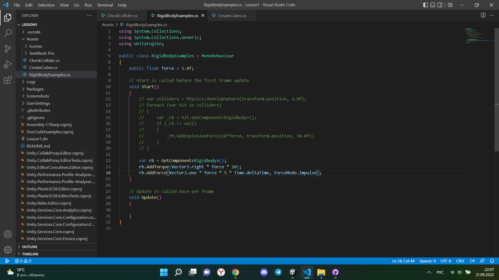

AddExplosionForce
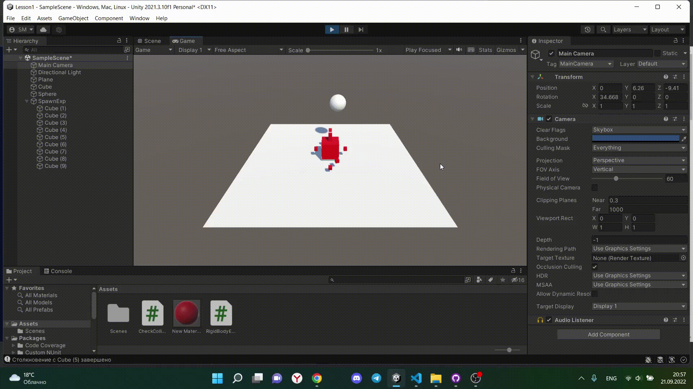

AddTorque
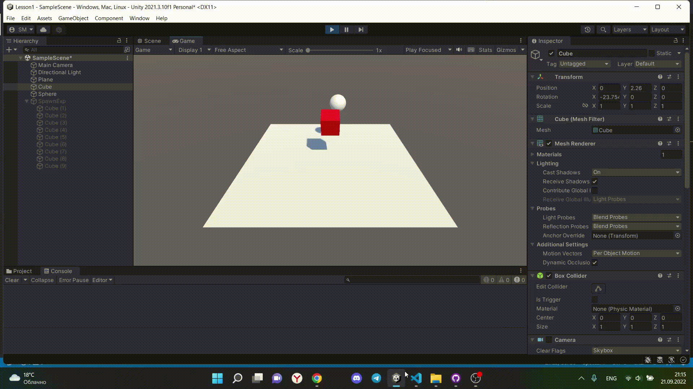

AddForce
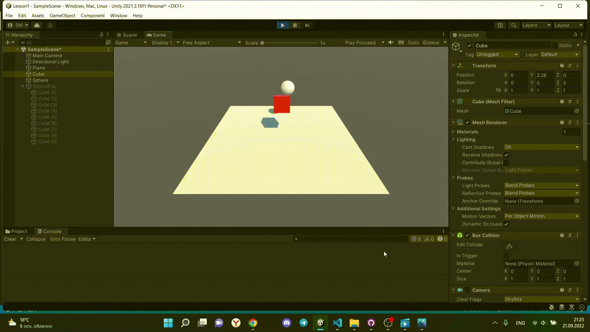

## Задание 3
### Реализуйте на сцене генерацию n кубиков. Число n вводится пользователем после старта сцены.
#### Ход работы (задание 3).
1)Создан TMP_InputFIeld
2)Код
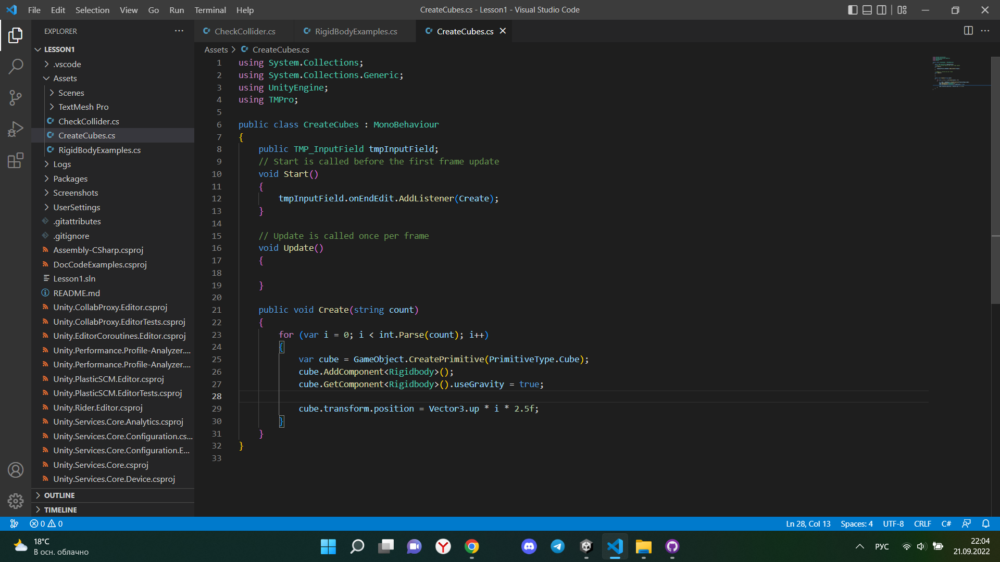
3)Выполнение
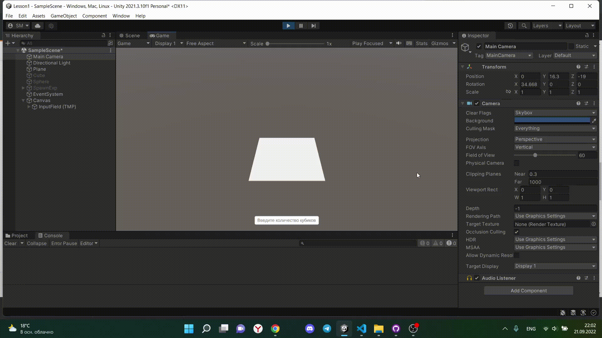

## Выводы
- Создал проект unity, в котором изучил взаимодейтсвие с объектами, работу rigidBody, элемент UI inputText и примитивные объекты unity
